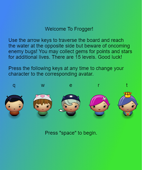
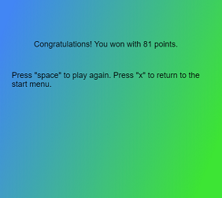

# Frogger

### Running The Application

### Structure
* The game includes 15 levels in which the user must traverse a crossing which contains enemies.
* The user traverses the board using the arrow keys.
* When the user comes in contact with an enemy, he/she loses a life and returns to the start of the level at the default position on screen.
* The user can also collect gems (of varying point values) and stars (which give extra lives).
* If the user loses all lives, then the game ends in a loss. If the user completes all 15 levels with at least one life left, then the game ends in a win.
* When the game ends, the player may then play again or return to the introductory page.

### Design
The game begins with an introductory page explaining how to play. It also lists the possible avatars for the user, along with the keys to be pressed to switch to those avatars. The player begins by pressing the "space" key.

  

The game page includes a background of grass, brick, and water units. The score, health, and level appear at the bottom. Enemy sprites cross the screen from left to right at varying speeds and positions. Gems and stars occasionally appear, bobbing up and down until collected. When a gem is collected, it disappears and its added point value drifts up the screen for several iterations. Blue gems are worth 3 points, green gems are worth 6 points, and orange gems are worth 9 points. Upon reaching levels 5, 10, and 15, an announcement appears across the screen for several iterations.

The end page is very similar to the introductory page and congratulates both losses and wins.

### Personal Programming Details
This was my first attempt at using object-oriented design in JavaScript to create a program. There are classes for the enemies (the bug sprites), the player, the health units appearing at the bottom of the screen, and the gem.

I am not fond of the user sprites but they seem to fit the theme.

### Remaining Issues
* The gems which appear in various levels are from image files which are rectangular, whereas the gems themselves have octagonal shapes. This makes the shapes appear incorrectly in the game.
* I would have liked to have had the user's sprite do something more noticeable upon finishing a level, like rotating 360 degrees. I tried using the `.save()` and `.restore()` functions in conjunction with the `.rotate` function but was unable to make it work correctly.
